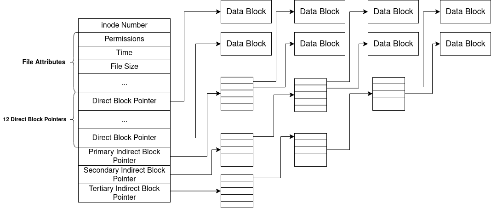

# VFS、FUSE、Passthrough与Overlay机制解析

[TOC]

## **1. VFS（Virtual File System）**

VFS 是 Linux 内核提供的抽象层，用于统一不同文件系统的访问接口，使上层应用无需关心底层文件系统的具体实现。

---

### **1.1 Superblock（超级块）**

Superblock 存储已挂载文件系统的元数据，通常包含：

- **文件系统类型**（如 ext4、XFS、Btrfs）
- **存储布局信息**：
  - 块大小、总块数、空闲块数
  - inode 数量、空闲 inode 数量
- **挂载信息**：
  - 挂载点、挂载选项（如 `ro`、`noatime`）
  - 挂载状态（如 `clean` 或 `dirty`）
- **文件系统特定配置**（如日志大小、压缩选项）

---

### **1.2 分配结构（Block Allocation）**

文件系统需要管理 inode 块和数据块的分配状态，常见的数据结构包括：

- **位图（Bitmap）**：
  - 用 0/1 表示块是否被占用（如 ext4）
  - 查询速度快，但可能产生碎片
- **空闲链表（Free List）**：
  - 维护空闲块的链表（如 FAT）
  - 适合简单文件系统，但随机访问效率低
- **B-Tree / B+Tree**：
  - 现代文件系统（如 XFS、Btrfs）使用 B-Tree 管理空闲块
  - 支持高效的范围查询和动态扩展
- **Extent（区段分配）**：
  - 记录连续空闲块的起始地址和长度（如 ext4、NTFS）
  - 减少碎片化，提升大文件存储效率

---

### **1.3 inode（索引节点）**

每个 inode 代表文件系统中的一个对象（文件、目录、设备等），存储元数据：

- **基本属性**：
  - 文件类型（普通文件、目录、符号链接、设备文件等）
  - 访问权限（`rwx` 位）
  - 所有者（UID/GID）
  - 文件大小（字节数）
  - 时间戳（`atime`、`mtime`、`ctime`）
  - 硬链接计数（删除文件时归零才真正释放）
- **动态 inode（现代文件系统）**：
  - 传统文件系统（如 ext2/ext3）固定 inode 数量
  - 现代文件系统（如 Btrfs、ZFS）支持动态分配
- **数据块指针**：
  - **直接指针**（通常 12 个，指向数据块）
  - **间接指针**（指向一个块，该块存储更多指针）
  - **双重间接指针**（指向指针的指针）
  - **三重间接指针**（某些文件系统支持）
- **扩展属性（xattr）**：
  - 存储额外的元数据（如 SELinux 标签、ACL）

---

### **1.4 目录项（Dentry, Directory Entry）**

目录是一种特殊文件，存储文件名到 inode 的映射：

- **目录结构**：
  - 每个目录至少包含两个硬链接：
    - `.`（指向自身）
    - `..`（指向父目录，根目录的 `..` 指向自身）
  - 存储 `<文件名, inode号>` 的映射
- **现代优化**：
  - **哈希表**（如 ext4 的 `htree`）加速查找
  - **B-Tree**（如 XFS、Btrfs）支持高效插入/删除

---

### **1.5 文件对象（File Object）**

文件对象（`struct file`）表示进程打开的文件：

- **核心字段**：
  - **打开模式**（`O_RDONLY`、`O_WRONLY`、`O_APPEND` 等）
  - **当前偏移量**（`f_pos`，记录读写位置）
  - **指向 inode 的指针**（`f_inode`）
  - **引用计数**（多个进程共享同一文件对象）
  - **操作函数表**（`file_operations`，如 `read`、`write`、`mmap`）
  - **私有数据**（文件系统或驱动可扩展使用）
- **与文件描述符（fd）的关系**：
  - 每个 `open()` 调用创建一个 `file` 对象
  - 多个 fd 可指向同一个 `file`（如 `dup()` 或 `fork()`）

---

## **2. FUSE（Filesystem in Userspace）**

FUSE 是一种允许非特权用户在用户空间实现文件系统的技术框架。通过将文件系统核心逻辑从内核态迁移到用户态，显著提升了开发灵活性和安全性，同时降低了与用户态服务（如远程存储、加密模块等）的集成复杂度。

---

### **2.1 设计理念**

1. **内核与用户态解耦**  
   - 文件系统逻辑运行在用户态，崩溃时仅影响当前挂载点，不会导致内核崩溃。
   - 通过权限隔离提升安全性（如限制文件系统进程的capabilities）。
2. **开发范式简化**  
   - 开发者只需实现预定义的接口（如`open`、`read`、`write`等），无需掌握内核编程技能。
   - 支持动态加载和卸载文件系统。

---

### **2.2 架构**

FUSE 采用分层架构，通过虚拟设备`/dev/fuse`实现内核与用户态的通信：

1. **内核模块**  
   - 拦截VFS请求并封装为FUSE协议消息（包含操作类型、参数等）。
   - 管理请求优先级（如中断处理优先于常规IO）。
   - 转发用户态响应至VFS层。
2. **用户态守护进程**  
   - 监听`/dev/fuse`设备，解析内核请求。
   - 执行自定义文件系统逻辑（如网络传输、加解密）。
   - 返回处理结果（数据或错误码）。

---

### **2.3 优势**

1. **跨语言支持**  
   兼容任何能操作文件描述符的语言（如Python/Go/Rust），无需内核模块开发。
2. **开发效率高**  
   - 代码修改后无需重启系统，直接重新挂载即可生效。
   - 支持调试工具（如gdb、strace）直接分析文件系统进程。
3. **场景多样性**  

   | 类型             | 案例                | 特点                     |
   | ---------------- | ------------------- | ------------------------ |
   | **加密文件系统** | EncFS, gocryptfs    | 用户态透明加解密         |
   | **网络文件系统** | SSHFS, s3fs         | 将远程存储映射为本地路径 |
   | **虚拟化存储**   | OverlayFS, mergerfs | 实现联合挂载或分层存储   |

---

### **2.4 局限性**

1. **性能瓶颈**  
   - 每次操作需至少2次上下文切换（用户态↔内核态）。
   - 数据拷贝开销大（可通过`io_uring`或`splice`优化）。
2. **功能限制**  
   - 部分VFS特性需额外适配（如`mmap`需实现`page cache`交互）。
   - 不支持某些内核级优化（如直接IO旁路）。
3. **稳定性风险**  
   用户态进程异常可能导致挂载点无响应（需守护进程自动恢复机制）。

---

## **3. PassthroughFS**

PassthroughFS 是一种特殊的虚拟文件系统，其核心设计理念是充当一个**透明的中间层**，将来自用户空间或上层文件系统的操作请求（如读写、属性查询等）几乎不做修改地直接转发（“透传”）给另一个底层的宿主文件系统。它本身**不存储任何文件数据或元数据**，主要功能是路由请求和进行必要的映射转换。

---

### **3.1 核心特性**

- **透明转发：** 所有文件操作请求（系统调用如 `open`, `read`, `write`, `getattr`, `mkdir` 等）被直接透传至宿主文件系统执行。
- **无存储层：** PassthroughFS 自身不维护数据块存储或元数据存储（如 inode 表），完全依赖底层宿主文件系统的存储能力。
- **路径映射：** 将用户或上层文件系统访问的**虚拟路径**（挂载点内的路径）转换为宿主文件系统上的**实际物理路径**。
- **权限与属性传递：** 保留并透传原始文件的权限、所有权（UID/GID）、时间戳等属性信息。权限检查由宿主文件系统执行。

---

### **3.2 实现方式**

本项目基于 **FUSE (Filesystem in Userspace)** 框架实现了 PassthroughFS。

当用户进程发起文件系统操作请求时：

1. 内核 VFS 层将请求路由到 FUSE 内核模块。
2. FUSE 内核模块将请求传递给运行在用户空间的 PassthroughFS 守护进程。
3. PassthroughFS 接收到请求后，**对请求中的路径、文件描述符（fd）或 inode 信息进行映射转换**，得到宿主文件系统上的目标路径或资源标识符。
4. PassthroughFS 使用标准的系统调用（如 `openat`, `read`, `write` 等）**直接访问宿主文件系统**上的映射后路径/资源。
5. PassthroughFS 将宿主文件系统返回的操作结果（数据、状态码、错误信息）通过 FUSE 接口**原样返回**给内核，最终传递给用户进程。

---

### **3.3 适用场景**

1. **容器/虚拟机文件访问透传**
    - **性能优势：** 接近原生文件系统的性能（主要在本地），远优于基于网络的远程文件系统（如 NFS, CIFS）。
    - **透明访问：** 容器/虚拟机内的应用无需修改即可访问宿主机上的文件，就像访问本地文件一样。
    - **安全隔离：** 通过精确配置权限映射和路径转换规则，可以控制容器/虚拟机只能访问宿主机文件系统的特定部分（如绑定挂载特定目录），避免暴露整个宿主文件系统。
2. **文件系统代理与扩展**
    - 作为底层文件系统的代理层，可以在透传过程中插入额外功能，如：
        - **日志记录：** 审计文件操作。
        - **性能分析：** 监控 IO 延迟、吞吐量。
        - **访问控制：** 实施更细粒度的权限策略（需在映射转换时实现）。

---

### **3.4 关键技术**

1. **权限映射 (UID/GID Mapping)**
    - **问题：** 容器/虚拟机内的用户（UID/GID）与宿主机上的用户（UID/GID）通常处于独立的命名空间。直接透传操作会导致权限错乱（例如，容器内的 `root` (UID 0) 在宿主机上可能对应一个普通用户或拥有破坏性权限）。
    - **解决方案：** 利用 **Linux User Namespace**。
        - 在挂载 PassthroughFS 时，指定用户和组的映射关系。
        - PassthroughFS 在将操作转发给宿主文件系统之前，需要根据配置的映射规则，**动态转换请求中涉及的 UID 和 GID**。这使得容器内的 `root` 在宿主文件系统上以受限用户（如 UID 1000）的身份操作。
2. **路径转换 (Path Translation)**
    - **核心：** 将用户请求的虚拟路径（相对于 PassthroughFS 挂载点）转换为宿主文件系统上的绝对路径。
    - **关键安全措施：**
        - **路径遍历防护：** 必须严格检查并处理路径中的 `..`（上一级目录）和符号链接（`symlink`），防止容器内应用通过 `../../../` 或恶意符号链接访问到挂载点之外的宿主文件系统路径，造成越权访问。
        - **根目录锁定：** 转换后的路径必须限定在预先配置给该 PassthroughFS 实例的宿主目录范围内。

---

## **4. OverlayFS**  

`OverlayFS`是一种联合挂载（Union Mount）的文件系统，它将多个目录（层）透明地合并成一个统一的视图。其核心设计目标是提供高效的分层存储和写时复制功能，在容器技术（如Docker、containerd）中成为镜像分层存储和容器运行时的基石，同时在快速环境构建、软件测试等场景中也有重要价值。

---

### **4.1 分层结构**

`OverlayFS` 分为`UpperLayer`和`LowerLayer`。`UpperLayer`必须可读可写，`LowerLayer`只需可读。`UpperLayer`只能有一个，`LowerLayer`可以有多个。

`MergedLayer`是用户最终看到的结果。`MergedLayer`是`UpperLayer`和`LowerLayer`联合挂载的结果。用户所感知的是单一、完整的文件系统。需要注意的是在`OverlayFS`中上层会遮蔽下层。如果一个文件在上层存在，那么用户的所有操作都只对上层的文件生效。

---

### **4.2 联合挂载机制**  

当挂载`OverlayFS`时，需要明确指定`LowerLayer`、`UpperLayer`和`MergedLayer`。  

`OverlayFS`负责在访问`MergedLayer`时，按特定规则从`LowerLayer(s)`和`UpperLayer`中查找和组合文件：

- **查找文件**： 当在`MergedLayer`中查找一个文件/目录时，首先在`UpperLayer`中查找。如果找到，则使用它；如果没找到，则依次在`LowerLayer(s)`中查找（从最上层的`LowerLayer`开始向下找，直到找到或搜索完）。

---
  
### **4.3 写时复制策略**

- **读取**： 读取文件直接从找到它的层（`UpperLayer`或某个`LowerLayer`）读取，无额外开销。

- **写入**：如果要修改一个存在于`LowerLayer`但不在`UpperLayer`中的文件，OverlayFS会先将该文件的完整副本从`LowerLayer`复制到`UpperLayer`（这就是“写时复制”），然后再修改`UpperLayer`中的这个副本。后续对该文件的读写都指向`UpperLayer`中的副本。  

---

### **4.4 应用价值**

1. 容器镜像分层存储：
   - 基础镜像共享： Docker镜像由多个只读层（`LowerLayer`）组成。一个基础镜像（如ubuntu:latest）可以被无数个基于它的镜像共享，物理上只存储一份。

   - 增量构建： Dockerfile中的每条指令（RUN, COPY, ADD等）通常生成一个新的只读层。这个层只包含该指令相对于前一层所做的修改。构建时，将前一层作为`LowerLayer`，新层作为临时的`UpperLayer`进行操作，构建完成后新层变成只读。

   - 节省存储空间： 不同容器镜像可以共享相同的基础层和中间层，只有最顶层的差异层（和容器自身的可写层）需要额外空间。极大减少了存储冗余。

   - 快速分发： 下载镜像时，只需要下载本地缺失的层。拉取镜像速度快。

2. 容器运行时：

   - 快速启动： 启动容器时，不需要复制整个镜像文件系统。容器的文件系统视图通过OverlayFS挂载实现：将镜像的所有只读层作为`LowerLayer`，为容器创建一个新的、空的`UpperLayer`（可写层），挂载到容器的`MergedLayer`。

   - 高效隔离： 每个容器拥有自己独立的`UpperLayer`。容器内对文件系统的所有修改（写、删）都只影响自己的`UpperLayer`，不会污染底层的镜像层，也不会影响其他共享相同镜像层的容器。

   - 资源高效： 多个运行相同镜像的容器共享底层的只读镜像数据，极大节省了内存和磁盘空间。

3. 环境快速构建与软件测试：

   - 快速创建沙盒环境： 基于一个干净的基础环境（作为`LowerLayer`），创建一个新的OverlayFS挂载（带空的`UpperLayer`）。用户可以在`MergedLayer`中进行任意的软件安装、配置修改、测试运行。

   - 瞬时重置： 测试完成后，只需简单地卸载OverlayFS并删除`UpperLayer`，所有在沙盒中所做的修改就完全消失了，环境瞬间恢复到原始的`LowerLayer`状态。无需复杂的清理或恢复操作。这比创建完整的虚拟机快得多，也比在物理机上卸载软件干净彻底得多。

   - 安全实验： 测试不稳定的软件或进行可能有破坏性的操作时，底层`LowerLayer`受到保护，系统不会真正损坏。

---

## **5. 对比总结**

| **特性**     | **VFS**          | **FUSE**               | **Passthrough**    | **OverlayFS**    |
| ------------ | ---------------- | ---------------------- | ------------------ | ---------------- |
| **实现位置** | 内核             | 用户态                 | 内核/用户态混合    | 内核             |
| **性能**     | 最优（原生路径） | 差（上下文切换）       | 中等（部分优化）   | 优（仅CoW开销）  |
| **灵活性**   | 低（需内核开发） | 极高（任意用户态逻辑） | 中（依赖直通范围） | 低（仅目录叠加） |
| **典型场景** | 所有文件系统基础 | 开发原型/网络FS        | 虚拟化/高性能FUSE  | 容器镜像/Live OS |

### 文件系统的一般特性

1. rename操作是原子的
2. 硬链接inode编号不变
3. 一个inode可以对应多个文件名
4. 硬链接只能在同一文件系统中创建
5. 创建硬链接会使inode中的链接计数加1
6. **当且仅当**inode中的链接计数为零时，文件才会被删除
7. 在同一文件系统中inode唯一
8. rename/mv 不会改变inode编号
9. 空目录有两个硬链接：
    - `.`指向自身
    - `..`指向父目录
10. 父目录的每一个子目录都会创建一个硬链接`..`指向父目录
11. rm会将inode的链接计数减一，当**链接计数为0**时inode和数据块才会被标记为空闲

---
